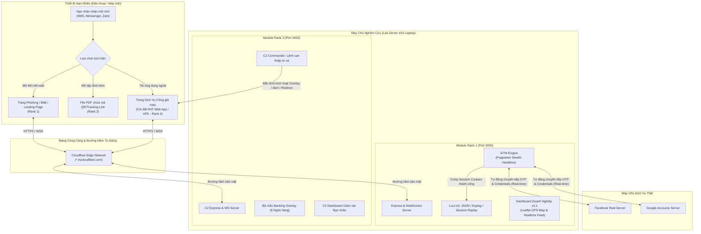

# HỆ THỐNG NGHIÊN CỨU CHUYÊN SÂU LỪA ĐẢO TRỰC TUYẾN & KHUNG GIẢI PHÁP PHÒNG THỦ TOÀN DIỆN
### (Advanced Online Fraud Simulation Lab & Defensive Security Framework)

> **Mã Đề án Nghiên cứu:** `68CS2-6` / `ducmanh-jr`  
> **Lĩnh vực:** An toàn Thông tin, Kỹ nghệ Xã hội (Social Engineering), Phân tích Mã độc Di động (Mobile Malware) & Phòng thủ Ứng dụng (Application Defense).  
> **Phiên bản:** `v3.1 Enterprise Research Edition`

---

## ⚠️ TUYÊN BỐ MIỄN TRỪ TRÁCH NHIỆM & ĐẠO ĐỨC NGHỀ NGHIỆP (LEGAL & ETHICAL DISCLAIMER)

> [!CAUTION]
> **DỰ ÁN ĐƯỢC XÂY DỰNG DUY NHẤT CHO MỤC ĐÍCH NGHIÊN CỨU HỌC THUẬT, GIẢNG DẠY VÀ NÂNG CAO NĂNG LỰC PHÒNG THỦ AN NINH MẠNG.**
> 
> Toàn bộ các công cụ, mã khai thác mô phỏng (PoC - Proof of Concept), kịch bản tấn công và cơ chế điều khiển trong kho lưu trữ này chỉ được phép vận hành trong **môi trường phòng thí nghiệm cô lập (Isolated Lab Environment)** hoặc trên **thiết bị và tài khoản thuộc quyền sở hữu hợp pháp của chính người thực nghiệm**.
>
> Nghiêm cấm tuyệt đối việc sử dụng bất kỳ phần nào của dự án này vào các hành vi:
> 1. Xâm nhập trái phép vào mạng máy tính, mạng viễn thông hoặc phương tiện điện tử của cá nhân, tổ chức khác.
> 2. Chiếm đoạt thông tin đăng nhập, tài sản hoặc tống tiền người dùng.
> 3. Bất kỳ hành vi nào vi phạm **Luật An ninh mạng Việt Nam (Luật số 24/2018/QH14)**, các Điều 288, 289, 290 **Bộ luật Hình sự Việt Nam 2015 (sửa đổi, bổ sung 2017)** và các quy định pháp luật sở tại.
>
> Tác giả và nhóm nghiên cứu hoàn toàn không chịu trách nhiệm đối với bất kỳ thiệt hại hoặc hậu quả pháp lý nào phát sinh do việc lạm dụng mã nguồn này ngoài mục đích nghiên cứu phòng thủ.

---

## 📑 MỤC LỤC

1. [Tổng Quan Dự Án & Bối Cảnh Thực Tiễn](#1-tổng-quan-dự-án--bối-cảnh-thực-tiễn)
2. [Kiến Trúc Tổng Thể & Chuỗi Tấn Công (Attack Kill Chain)](#2-kiến-trúc-tổng-thể--chuỗi-tấn-công-attack-kill-chain)
3. [Phân Tích Chi Tiết 3 Cấp Độ Tấn Công (Rank 1 - 2 - 3)](#3-phân-tích-chi-tiết-3-cấp-độ-tấn-công-rank-1---2---3)
   - [Rank 1: Phishing Link, BitB & AiTM Session Hijacking](#rank-1-phishing-link-bitb--aitm-session-hijacking)
   - [Rank 2: Phishing qua Tài liệu PDF & Quishing](#rank-2-phishing-qua-tài-liệu-pdf--quishing)
   - [Rank 3: Mobile RAT, Accessibility Abuse & Banking Overlay](#rank-3-mobile-rat-accessibility-abuse--banking-overlay)
4. [Khung Giải Pháp Phòng Thủ Toàn Diện (Defensive Security Framework)](#4-khung-giải-pháp-phòng-thủ-toàn-diện-defensive-security-framework)
5. [Cấu Trúc Thư Mục Dự Án (Repository Tree)](#5-cấu-trúc-thư-mục-dự-án-repository-tree)
6. [Yêu Cầu Hệ Thống & Hướng Dẫn Cài Đặt](#6-yêu-cầu-hệ-thống--hướng-dẫn-cài-đặt)
7. [Hướng Dẫn Khởi Chạy & Thử Nghiệm Xuyên Mạng (Cross-Network Testing)](#7-hướng-dẫn-khởi-chạy--thử-nghiệm-xuyên-mạng-cross-network-testing)
8. [Kịch Bản Thực Nghiệm Từng Bước (Step-by-Step Simulation Scenarios)](#8-kịch-bản-thực-nghiệm-từng-bước-step-by-step-simulation-scenarios)
9. [Chi Tiết Đặc Tả API & Giao Thức WebSocket](#9-chi-tiết-đặc-tả-api--giao-thức-websocket)
10. [Công Nghệ & Thư Viện Sử Dụng](#10-công-nghệ--thư-viện-sử-dụng)

---

## 1. TỔNG QUAN DỰ ÁN & BỐI CẢNH THỰC TIỄN

### 1.1 Bối cảnh thực tế tại Việt Nam và Thế giới
Trong những năm gần đây, tội phạm công nghệ cao và các đường dây lừa đảo trực tuyến (Online Fraud Syndicates) tại khu vực Đông Nam Á đã chuyển dịch phương thức tấn công từ các hình thức lừa gạt thủ công sang **các chiến dịch kỹ thuật cao, đa tầng**:
- **Giai đoạn 1 (Thu thập & dụ dỗ):** Sử dụng tin nhắn SMS Brandname giả mạo, tin nhắn Messenger/Zalo mạo danh người thân hoặc thông báo giả từ cơ quan thuế/công an.
- **Giai đoạn 2 (Vượt rào bảo mật 2FA):** Thay vì chỉ đánh cắp mật khẩu tĩnh, kẻ tấn công áp dụng kỹ thuật **AiTM (Adversary-in-the-Middle)** để cướp phiên đăng nhập (Session Hijacking) hoặc giả lập cửa sổ trình duyệt **BitB (Browser-in-the-Browser)**.
- **Giai đoạn 3 (Kiểm soát hoàn toàn thiết bị):** Dụ dỗ nạn nhân tải tệp tin giả mạo (thường là `.apk` mạo danh `VNeID`, `eTax Mobile`) và lừa người dùng cấp **Quyền Trợ Năng (Accessibility Service)** trên hệ điều hành Android, từ đó âm thầm đọc OTP, vẽ đè màn hình ngân hàng và thực hiện lệnh chuyển tiền tự động ngầm.

### 1.2 Mục tiêu của dự án
Dự án được triển khai nhằm mục đích:
1. **Xây dựng Lab mô phỏng thực tế (Simulation Lab):** Tái lập chuỗi tấn công hoàn chỉnh từ góc độ kẻ tấn công (Red Team) để thấu hiểu tường tận hành vi, điểm yếu con người và lỗ hổng công nghệ.
2. **Khả năng kiểm thử xuyên mạng không cần mở port:** Tích hợp đường hầm bảo mật **Cloudflare Tunnel**, cho phép người nghiên cứu chỉ cần một chiếc laptop cá nhân là có thể gửi link thử nghiệm tới điện thoại cá nhân ở bất kỳ đâu (dùng 4G/5G hoặc mạng Wi-Fi khác).
3. **Xây dựng Trung tâm Chỉ huy & Giám sát (C2 Dashboard):** Trực quan hóa dữ liệu thu hoạch theo thời gian thực (Real-time WebSockets), định vị thiết bị trên bản đồ GPS, ghi hình hành vi người dùng (Session Replay).
4. **Xây dựng Khung Phòng Thủ Toàn Diện (Blue Team / Defensive Framework):** Đưa ra giải pháp kỹ thuật cụ thể (FIDO2/WebAuthn, RASP cho ứng dụng ngân hàng, YARA Rules cho hệ thống lọc email) nhằm triệt tiêu các bề mặt tấn công.

---

## 2. KIẾN TRÚC TỔNG THỂ & CHUỖI TẤN CÔNG (ATTACK KILL CHAIN)

### 2.1 Sơ đồ Luồng Hoạt Động Của Hệ Thống



### 2.2 Bảng Ma Trận So Sánh Các Cấp Độ (Attack Matrix)

| Tiêu chí | Rank 1: Phishing Link & AiTM | Rank 2: PDF Phishing | Rank 3: Mobile RAT & Overlay |
| :--- | :--- | :--- | :--- |
| **Bề mặt tấn công** | Trình duyệt web (Mobile & Desktop) | Trình xem PDF & Email Gateway | Hệ điều hành di động (Android OS) |
| **Yêu cầu từ nạn nhân** | Nhập mật khẩu / mã OTP | Mở tệp, quét mã QR hoặc click link | Cấp quyền Trợ năng (Accessibility) |
| **Công nghệ cốt lõi** | WebSocket, Puppeteer Stealth, BitB | Quishing, Tracking Pixel, PDF Actions | WebSocket C2, Accessibility Abuse, Banking Overlay |
| **Mục tiêu đánh cắp** | Mật khẩu, OTP, Session Cookie (Cướp phiên) | Dẫn dụ sang Rank 1, trinh sát email | Toàn quyền kiểm soát máy, SMS OTP, tiền ngân hàng |
| **Khả năng qua mặt 2FA** | **Có** (Bypass 2FA thời gian thực qua AiTM) | Gián tiếp (qua Rank 1) | **Hoàn toàn** (Đọc lén SMS OTP ngầm) |
| **Mức độ nguy hại** | ⭐⭐⭐⭐ (Rất cao) | ⭐⭐⭐ (Trung bình - Cao) | ⭐⭐⭐⭐⭐ (Nguy hiểm tối đa) |

---

## 3. PHÂN TÍCH CHI TIẾT 3 CẤP ĐỘ TẤN CÔNG (RANK 1 - 2 - 3)

---

### RANK 1: PHISHING LINK, BITB & AiTM SESSION HIJACKING
*Mã nguồn nằm trong thư mục: `rank1_Phishing_Link/` (Khởi chạy trên Port `3000`)*

Mô-đun Rank 1 tập trung khai thác điểm yếu con người (Social Engineering) kết hợp với các công nghệ tấn công web tiên tiến nhất:

#### 1. Mồi nhử Dẫn dụ (Social Engineering Landing Pages)
Hệ thống chuẩn bị sẵn 3 kịch bản mồi nhử tâm lý phổ biến:
- **Vòng quay may mắn / Trúng thưởng (`/landing/prize.html`):** Khai thác lòng tham, thông báo người dùng trúng thưởng iPhone 15 Pro Max hoặc tiền mặt, yêu cầu đăng nhập để nhận quà.
- **Cảnh báo an ninh tài khoản (`/landing/security.html`):** Khai thác nỗi sợ hãi, cảnh báo tài khoản bị đăng nhập từ thiết bị lạ ở địa phương khác, thúc giục xác minh khẩn cấp.
- **Thông báo giữ kiện hàng bưu chính (`/landing/delivery.html`):** Khai thác sự tò mò/công việc, thông báo kiện hàng chuyển phát nhanh bị tạm giữ do sai thông tin.

#### 2. Kỹ thuật Đăng nhập Giả mạo Đa dạng
- **Trang giả mạo Facebook & Google chuẩn Pixel-Perfect (`/phishing/facebook.html`, `/phishing/google.html`):** Mô phỏng chuẩn xác từng font chữ, responsive layout trên mobile và desktop.
- **Tấn công Browser-in-the-Browser - BitB (`/phishing/bitb-google.html`):**
  - Giả lập một cửa sổ pop-up của hệ điều hành Windows/macOS lồng ngay bên trong trang web.
  - Hiển thị thanh địa chỉ giả mạo có biểu tượng khóa SSL màu xanh và URL hợp lệ (`accounts.google.com`).
  - Cho phép người dùng rê chuột kéo thả (draggable) cửa sổ giả lập như một cửa sổ thật, làm cho các biện pháp kiểm tra URL thông thường của người dùng bị vô hiệu hóa hoàn toàn.

#### 3. Cỗ máy Chuyển tiếp Xác thực Thời gian thực AiTM (Adversary-in-the-Middle)
- Được điều khiển bởi tệp [`aitm-engine.js`](file:///c:/Users/Admin/dm/68CS2-6/ducmanh-jrresearch_on_online_fraud_MA/rank1_Phishing_Link/aitm/aitm-engine.js) sử dụng thư viện **Puppeteer** kết hợp plugin ẩn danh **Puppeteer-Extra-Plugin-Stealth**.
- **Quy trình hoạt động:**
  1. Nạn nhân truy cập `/phishing/aitm-facebook.html` và nhập Email, Mật khẩu.
  2. Server khởi tạo một trình duyệt ngầm (Headless Chromium) trên laptop của kẻ tấn công, điều hướng trực tiếp vào máy chủ đăng nhập thật của Facebook/Google.
  3. Điền thông tin đăng nhập của nạn nhân vào form thật.
  4. Nếu tài khoản bật xác thực hai yếu tố (2FA), máy chủ Facebook thật sẽ trả về màn hình yêu cầu nhập mã OTP (Checkpoint).
  5. Cỗ máy AiTM phát hiện checkpoint này, lập tức gửi tín hiệu WebSocket về trình duyệt nạn nhân để đổi giao diện sang màn hình "Nhập mã xác nhận 6 chữ số".
  6. Nạn nhân nhận mã SMS OTP hoặc Authenticator thật trên điện thoại và nhập vào trang giả.
  7. Cỗ máy lấy mã OTP đó submit ngay lập tức vào trình duyệt Chromium ngầm.
  8. Sau khi vượt qua kiểm tra, cỗ máy trích xuất toàn bộ **Session Cookies** quan trọng (`c_user`, `xs`, `datr`, `fr`, `sb` đối với Facebook, hoặc `SID`, `HSID`, `SSID` đối với Google) và lưu trữ vào tệp `stolen_sessions.json`.
  9. **Kết quả:** Kẻ tấn công có thể nạp các Cookie này vào trình duyệt của mình để truy cập thẳng vào tài khoản nạn nhân mà không cần biết mật khẩu mới đổi hay cần mã 2FA trong các lần sau.

#### 4. Trinh sát Thiết bị Chuyên sâu (Advanced Fingerprinting & Geolocation)
Tệp [`fingerprint.js`](file:///c:/Users/Admin/dm/68CS2-6/ducmanh-jrresearch_on_online_fraud_MA/rank1_Phishing_Link/public/phishing/fingerprint.js) thu thập toàn diện dấu vết số:
- **Thông tin phần cứng:** Hệ điều hành, phiên bản OS, Trình duyệt, CPU Core, RAM ước lượng, GPU Renderer & Vendor qua WebGL API, Mức pin & Trạng thái sạc (Battery API), Độ phân giải màn hình & tỷ lệ điểm ảnh (Pixel Ratio).
- **Dấu vết Canvas & Audio:** Tạo chuỗi băm (hash) đặc trưng cho từng card đồ họa và bộ xử lý âm thanh của máy tính/điện thoại.
- **Cơ chế Định vị Kép (Dual Geolocation Engine):**
  - *GPS HTML5:* Nếu nạn nhân cấp quyền, lấy tọa độ vệ tinh chính xác đến từng mét.
  - *Server-side IP Fallback:* Nếu nạn nhân từ chối cấp quyền hoặc mở link trong trình duyệt nhúng (Facebook in-app WebView chặn Geolocation), máy chủ tự động truy vấn qua 2 cổng dịch vụ định vị IP độc lập (`ipapi.co` và `ip-api.com`) để xác định Tỉnh/Thành phố, Nhà mạng cung cấp Internet (ISP) và tự động sinh link Google Maps trực tiếp.

#### 5. Keylogger & Session Replay Thời gian thực
- **Keylogger:** Bắt từng sự kiện phím (`keyup`) ngay khi nạn nhân vừa gõ vào các ô input. Dù người dùng nhận ra bị lừa và đóng trang trước khi bấm "Đăng nhập", kẻ tấn công vẫn đã thu được toàn bộ nội dung đã gõ.
- **Session Replay:** Ghi nhận toàn bộ tọa độ chuột di chuyển (`mousemove`), sự kiện nhấp chuột (`click`), thao tác cuộn trang (`scroll`) và độ trễ do dự (`hesitation`). Bảng điều khiển tích hợp tính năng phát lại video mô phỏng chân thực từng hành vi của nạn nhân trên trang.

#### 6. Dashboard Giám sát Doanh nghiệp (Enterprise C2 Dashboard v3.1)
- Giao diện thiết kế theo phong cách Light Enterprise hiện đại, tinh gọn với Lucide Icons.
- Bản đồ tương tác vệ tinh sử dụng thư viện **Leaflet.js** đánh dấu tọa độ vị trí của tất cả các nạn nhân đã truy cập.
- Kênh WebSocket đẩy thông báo Real-time (Push notifications) ngay khi có người nhấp link, gõ phím hay cướp cookie thành công.

---

### RANK 2: PHISHING QUA TÀI LIỆU PDF & QUISHING
*Được nghiên cứu và tài liệu hóa chi tiết trong tệp: [`DEFENSE_FRAMEWORK.md`](file:///c:/Users/Admin/dm/68CS2-6/ducmanh-jrresearch_on_online_fraud_MA/DEFENSE_FRAMEWORK.md)*

Rank 2 đóng vai trò là "Bức bình phong" trung gian nhằm qua mặt các bộ lọc an ninh email (Secure Email Gateway - SEG) và các hệ thống phát hiện tên miền độc hại:

1. **Cơ chế vượt rào kiểm duyệt:** Các bộ lọc thư rác thường kiểm tra nội dung liên kết đặt trực tiếp trong văn bản email (`Body text`). Kẻ tấn công né tránh điều này bằng cách đính kèm một tệp PDF có định dạng trang trọng (ví dụ: *Hóa đơn tiền điện EVN, Thông báo nợ cước viễn thông, Quyết định xử phạt thuế, Phiếu lương mật*).
2. **Kỹ thuật Quishing (QR Code Phishing):** Bên trong file PDF không chứa liên kết dạng văn bản mà in một mã QR Code bắt mắt yêu cầu quét để thanh toán hoặc xác nhận. Khi nạn nhân dùng điện thoại cá nhân quét mã QR, luồng duyệt web sẽ chuyển từ máy tính công ty (có tường lửa bảo vệ) sang mạng 4G cá nhân của điện thoại, dẫn thẳng vào bẫy Rank 1.
3. **Cắm Tracking Pixel qua Remote URI:** Sử dụng các thẻ hành động `/URI` hoặc `/Launch` của chuẩn định dạng PDF. Khi người dùng mở tệp bằng các phần mềm xem PDF phổ biến (Acrobat Reader, Foxit), tệp sẽ âm thầm gửi yêu cầu HTTP GET đến máy chủ kẻ tấn công để báo cáo rằng con mồi đã mở tài liệu và chuẩn bị hành vi tiếp theo.

---

### RANK 3: MOBILE RAT, ACCESSIBILITY ABUSE & BANKING OVERLAY
*Mã nguồn nằm trong thư mục: `rank3_Mobile_RAT/` (Khởi chạy trên Port `3002`)*

Đây là cấp độ tấn công kỹ thuật cao và nguy hiểm nhất, nhắm trực tiếp vào người dùng điện thoại thông minh Android tại Việt Nam:

#### 1. Kịch bản Dụ dỗ Cài đặt Ứng dụng Quản lý Nhà nước (`/mobile/index.html`)
- Giả mạo giao diện chính thức của **Cổng Dịch Vụ Công Quốc Gia**.
- Cảnh báo người dùng cần phải nâng cấp tài khoản định danh điện tử hoặc hoàn thành nghĩa vụ quyết toán thuế điện tử.
- Cung cấp hai nút bấm tải ứng dụng mạo danh:
  - 🏛️ **eTax Mobile** (Tổng Cục Thuế — Bộ Tài Chính)
  - 🛡️ **VNeID** (Bộ Công An — Trung tâm Dữ liệu Quốc gia về Dân cư)

#### 2. Lạm dụng Quyền Trợ Năng (Accessibility Service Abuse)
- Ứng dụng mã độc mô phỏng (`rat-app.html`) sau khi mở sẽ hiển thị màn hình hướng dẫn người dùng bật **Dịch vụ Trợ năng (Accessibility Service)** trong phần cài đặt Android với lý do *"Cần quyền hỗ trợ tự động điền hồ sơ định danh"*.
- **Tại sao quyền Trợ năng lại nguy hiểm nhất?**
  - Được thiết kế ban đầu để hỗ trợ người khuyết tật, quyền này cho phép ứng dụng đọc toàn bộ văn bản xuất hiện trên màn hình (Screen Scraping).
  - Có thể tự động mô phỏng các cú chạm (Click hijacking) mà người dùng không hề hay biết.
  - Lắng nghe toàn bộ sự kiện nhập bàn phím trong mọi ứng dụng khác (Keylogging toàn hệ thống).
  - Cho phép hiển thị các cửa sổ đè lên ứng dụng khác (System Alert Window / Window Overlay).

#### 3. Tấn công Màn hình Phủ Giả mạo (Dynamic Banking Overlay)
- Ứng dụng theo dõi liên tục xem người dùng có mở ứng dụng ngân hàng hay không. Khi ứng dụng ngân hàng mục tiêu khởi chạy, mã độc lập tức kích hoạt một màn hình đăng nhập giả mạo đè khít lên màn hình thật (`rat-app.html#screen-overlay`).
- Hỗ trợ đầy đủ bộ nhận diện thương hiệu của **8 Ngân hàng & Ví điện tử hàng đầu Việt Nam**:
  1. **Vietcombank** (VCB)
  2. **Techcombank** (TCB)
  3. **MBBank** (MB)
  4. **BIDV**
  5. **VietinBank** (VTB)
  6. **Agribank** (AGR)
  7. **Ví MoMo**
  8. **Ví ZaloPay**
- Giao diện overlay tự đổi màu sắc, logo và tiêu đề tương ứng với từng ngân hàng. Khi người dùng nhập tên đăng nhập và mật khẩu vào đây, dữ liệu được truyền thẳng về máy chủ C2 qua kênh WebSocket.

#### 4. Đánh cắp Mã Xác Thực SMS OTP
- Ngay sau khi lấy được thông tin đăng nhập, mã độc chuyển nạn nhân sang màn hình nhập mã xác thực OTP giao dịch.
- Hệ thống mô phỏng việc đọc lén tin nhắn OTP từ ngân hàng hoặc hiển thị nội dung tin nhắn giả mạo để lừa nạn nhân nộp nốt chốt chặn bảo mật cuối cùng.

#### 5. Bảng Điều khiển Ra Lệnh Tác chiến Từ xa (Mobile C2 Dashboard)
- Quản lý danh sách toàn bộ thiết bị nạn nhân đang kết nối (`Online` / `Offline`).
- Hiển thị thông số chi tiết của máy nạn nhân (Model máy, hệ điều hành, trình duyệt, trạng thái cấp quyền Trợ năng).
- **Bộ lệnh C2 can thiệp từ xa (Remote Command Execution):**
  - `trigger_overlay`: Bắn lệnh từ laptop ép điện thoại nạn nhân phải bung ngay màn hình đăng nhập giả mạo của một ngân hàng cụ thể.
  - `show_alert`: Gửi hộp thoại thông báo khẩn cấp lên màn hình điện thoại nạn nhân.
  - `redirect`: Điều hướng điện thoại nạn nhân tới một trang web bất kỳ.

---

## 4. KHUNG GIẢI PHÁP PHÒNG THỦ TOÀN DIỆN (DEFENSIVE SECURITY FRAMEWORK)

Song song với việc phân tích mã độc, dự án đề xuất một khung giải pháp kỹ thuật phòng thủ đa tầng (Blue Team Architecture) để triệt tiêu các mối đe dọa trên:

```
                  +-----------------------------------------------------------+
                  |         KIẾN TRÚC PHÒNG THỦ ĐA TẦNG (DEFENSE-IN-DEPTH)     |
                  +-----------------------------------------------------------+
                                                |
         +--------------------------------------+--------------------------------------+
         |                                      |                                      |
         v                                      v                                      v
  [ PHÒNG THỦ RANK 1 ]                   [ PHÒNG THỦ RANK 2 ]                   [ PHÒNG THỦ RANK 3 ]
  Chống Phishing & AiTM                  Bảo vệ Tệp PDF & Email                 Chống Mobile RAT & Overlay
  - FIDO2 / WebAuthn                     - CDR (PDF Sanitization)               - RASP Module phát hiện
    (Kháng 100% AiTM Proxy)              - YARA Detection Rules                   Accessibility Abuse
  - Cấu hình HSTS & CSP                  - Acrobat Protected Sandbox            - Bật FLAG_SECURE chống chụp
  - DMARC / DKIM / SPF                   - Vô hiệu hóa URL Remote Actions       - Keystore & Biometrics
```

### 4.1 Giải pháp phòng thủ Rank 1 (Chống Phishing Link & AiTM)

#### A. Triển khai Chuẩn Xác thực FIDO2 / WebAuthn (Bắt buộc cho Ngân hàng)
- **Cơ chế cốt lõi:** Khác với mật khẩu hay SMS OTP/Google Authenticator (là các chuỗi ký tự mà người dùng có thể nhìn thấy và gõ vào trang web giả mạo), chuẩn **FIDO2/WebAuthn** sử dụng cặp khóa bất đối xứng (Public/Private Key) gắn liền với tên miền (Origin-Bound).
- **Khả năng triệt tiêu AiTM:** Dù kẻ tấn công dùng Cloudflare Tunnel hay tên miền tinh vi đến đâu (`trycloudflare.com`, `login.facebook-security.com`), trình duyệt web của nạn nhân sẽ so khớp tên miền gốc của máy chủ xác thực với tên miền đang mở. Khi phát hiện lệch tên miền, trình duyệt **tự động từ chối ký chữ ký số**, khiến cỗ máy AiTM hoàn toàn vô dụng.

```javascript
// Ví dụ Mã nguồn Kỹ thuật: Xác thực WebAuthn (FIDO2) chống Phishing trên Client
async function authenticatePhishingResistant() {
    const publicKeyCredentialRequestOptions = {
        challenge: new Uint8Array([/* Challenge ngẫu nhiên từ Server */]),
        timeout: 60000,
        rpId: "your-bank.com", // Trình duyệt kiểm tra ngặt nghèo Domain gốc
        userVerification: "required"
    };

    try {
        // Trình duyệt sẽ CHẶN nếu domain hiện tại khác your-bank.com (ví dụ: aitm-proxy.com)
        const assertion = await navigator.credentials.get({
            publicKey: publicKeyCredentialRequestOptions
        });
        console.log("Xác thực FIDO2 thành công - Kháng 100% AiTM Phishing");
    } catch (err) {
        console.error("Xác thực thất bại do lệch Tên miền (Domain Mismatch) hoặc bị hủy", err);
    }
}
```

#### B. Cấu hình DNS & HTTP Security Headers
- **DMARC, DKIM, SPF:** Ngăn chặn tuyệt đối việc kẻ tấn công mạo danh địa chỉ email ngân hàng gửi thông báo giả.
- **Strict-Transport-Security (HSTS) & Content-Security-Policy (CSP):** Hạn chế các mã script ngoại vi tải lậu vào trang đăng nhập.

---

### 4.2 Giải pháp phòng thủ Rank 2 (Bảo vệ Tập tin PDF & Cổng Email)

#### A. Quy tắc YARA kiểm duyệt Tệp PDF Độc hại trên Mail Gateway
Thêm quy tắc YARA vào Secure Email Gateway (SEG) để phát hiện và cô lập các tệp PDF chứa liên kết khả nghi hoặc cơ chế theo dõi ngầm:

```yara
rule PDF_Phishing_Tracking_URI {
    meta:
        description = "Phát hiện file PDF chứa liên kết Phishing hoặc Tracking Pixel"
        author = "Defensive Security Team"
        severity = "HIGH"
    strings:
        $header = "%PDF-"
        $uri = "/URI (" ascii
        $action = "/S /URI" ascii
        $js = "/JavaScript" ascii wide
        $launch = "/Launch" ascii wide
    condition:
        $header at 0 and ($uri or $action) and ($js or $launch)
}
```

#### B. Giải pháp CDR (Content Disarm and Reconstruction)
Hệ thống nhận tệp PDF, tự động bóc tách và loại bỏ hoàn toàn các siêu liên kết (hyperlinks), mã thực thi JavaScript, hành vi form submit và chỉ render lại một bản sao hình ảnh tĩnh an toàn gửi cho nhân viên.

---

### 4.3 Giải pháp phòng thủ Rank 3 (Chống Mobile RAT, Overlay & Accessibility)

#### A. Module RASP Kiểm Tra Quyền Trợ Năng Bất Thường (Dành cho App Ngân Hàng)
Ứng dụng ngân hàng phải tích hợp module **RASP (Runtime Application Self-Protection)** để chủ động kiểm tra xem có ứng dụng thứ ba không tin cậy nào đang bật quyền Trợ năng hay không. Nếu phát hiện, ứng dụng lập tức khóa màn hình và từ chối giao dịch:

```kotlin
// Mã nguồn Kotlin mẫu tích hợp vào ứng dụng Android Ngân hàng
import android.content.Context
import android.provider.Settings
import android.text.TextUtils

class AntiRatSecurityManager(private val context: Context) {

    fun isSuspiciousAccessibilityEnabled(): Boolean {
        val accessibilityEnabled = Settings.Secure.getInt(
            context.contentResolver,
            Settings.Secure.ACCESSIBILITY_ENABLED, 0
        )
        
        if (accessibilityEnabled == 1) {
            val settingValue = Settings.Secure.getString(
                context.contentResolver,
                Settings.Secure.ENABLED_ACCESSIBILITY_SERVICES
            )
            if (!TextUtils.isEmpty(settingValue)) {
                // Tách danh sách các dịch vụ trợ năng đang kích hoạt
                val services = settingValue.split(":")
                for (service in services) {
                    if (!isTrustedSystemService(service)) {
                        // CẢNH BÁO: Phát hiện ứng dụng lạ đang chiếm quyền Trợ Năng!
                        return true
                    }
                }
            }
        }
        return false
    }

    private fun isTrustedSystemService(serviceName: String): Boolean {
        // Chỉ tin tưởng các dịch vụ trợ năng mặc định của hệ điều hành Google
        return serviceName.contains("com.google.android.marvin.talkback") ||
               serviceName.contains("com.android.talkback")
    }
}
```

#### B. Cơ chế Chống Vẽ Đè Màn Hình (Anti-Overlay & Tapjacking)
Trong mọi `Activity` nhạy cảm của ứng dụng ngân hàng (Đăng nhập, Chuyển tiền), lập trình viên bắt buộc phải kích hoạt 2 cờ bảo mật của Android SDK:

```java
@Override
protected void onCreate(Bundle savedInstanceState) {
    super.onCreate(savedInstanceState);
    
    // 1. Chống chụp ảnh màn hình, chống ghi màn hình ngầm và chống hiển thị trong cửa sổ đa nhiệm
    getWindow().setFlags(
        WindowManager.LayoutParams.FLAG_SECURE,
        WindowManager.LayoutParams.FLAG_SECURE
    );
    
    // 2. Chặn tương tác chạm nếu có cửa sổ khác đang vẽ đè lên trên (Chống Tapjacking / Overlay)
    View rootView = findViewById(android.R.id.content);
    rootView.setFilterTouchesWhenObscured(true);
}
```

#### C. Chuyển đổi Khóa Phần cứng Sinh trắc học (Hardware-backed Biometrics)
Thay thế việc gửi mã OTP qua tin nhắn SMS truyền thống (rất dễ bị RAT đọc trộm) bằng việc xác thực qua **Android Keystore / StrongBox Keymaster** gắn với cảm biến vân tay hoặc khuôn mặt. Khóa bí mật (Private Key) được lưu trong phần cứng an toàn (Secure Enclave / TPM), không một mã độc RAT nào có thể trích xuất hay giả mạo thao tác ký số sinh trắc học này.

---

## 5. CẤU TRÚC THƯ MỤC DỰ ÁN (REPOSITORY TREE)

```
ducmanh-jrresearch_on_online_fraud_MA/
├── DEFENSE_FRAMEWORK.md          # Báo cáo Chuyên sâu về Khung Giải pháp Phòng thủ
├── README.md                     # Tài liệu Toàn diện về Toàn bộ Dự án (Tài liệu này)
├── start-rank1.cmd               # Script 1-Click khởi chạy Module Rank 1 (Port 3000)
├── start-rank3.cmd               # Script 1-Click khởi chạy Module Rank 3 (Port 3002)
│
├── rank1_Phishing_Link/          # MODULE RANK 1: PHISHING LINK & AiTM
│   ├── aitm/
│   │   └── aitm-engine.js        # Cỗ máy AiTM điều khiển Puppeteer Stealth vượt 2FA
│   ├── public/
│   │   ├── dashboard/            # Bảng điều khiển Giám sát C2 Rank 1
│   │   │   ├── index.html        # Giao diện chính Enterprise Dashboard v3.1
│   │   │   ├── dashboard-style.css
│   │   │   └── dashboard-script.js
│   │   ├── landing/              # Kịch bản Dẫn dụ (Social Engineering Baits)
│   │   │   ├── prize.html        # Kịch bản Vòng quay may mắn / Trúng thưởng
│   │   │   ├── security.html     # Kịch bản Cảnh báo bảo mật bất thường
│   │   │   └── delivery.html     # Kịch bản Thông báo giữ kiện hàng bưu điện
│   │   └── phishing/             # Các trang Thu hoạch Thông tin Đăng nhập
│   │       ├── facebook.html     # Trang đăng nhập Facebook giả mạo
│   │       ├── fb-script.js
│   │       ├── fb-style.css
│   │       ├── google.html       # Trang đăng nhập Google giả mạo
│   │       ├── gg-script.js
│   │       ├── gg-style.css
│   │       ├── bitb-google.html  # Tấn công Browser-in-the-Browser (BitB) Google
│   │       ├── bitb-script.js
│   │       ├── bitb-style.css
│   │       ├── aitm-facebook.html# Trang Phishing AiTM tích hợp vượt 2FA
│   │       ├── aitm-script.js
│   │       └── fingerprint.js    # Script trinh sát phần cứng & tọa độ GPS
│   ├── campaigns.json            # Quản lý danh sách chiến dịch
│   ├── harvested_data.json       # Dữ liệu tài khoản/mật khẩu đã thu hoạch
│   ├── keylog_data.json          # Dữ liệu từng phím gõ thời gian thực
│   ├── fingerprint_data.json     # Dữ liệu trinh sát phần cứng & IP nạn nhân
│   ├── session_replay.json       # Dữ liệu hành vi chuột & cuộn trang
│   ├── stolen_sessions.json      # Danh sách Session Cookies cướp được qua AiTM
│   ├── package.json
│   └── server.js                 # Máy chủ Express, WebSocket & Cloudflare Tunnel
│
└── rank3_Mobile_RAT/             # MODULE RANK 3: MOBILE RAT & BANKING OVERLAY
    ├── public/
    │   ├── dashboard/            # Bảng điều khiển C2 Giám sát Thiết bị Di động
    │   │   ├── index.html        # Giao diện C2 Dashboard
    │   │   ├── dashboard-style.css
    │   │   └── dashboard-script.js
    │   └── mobile/               # Giao diện Web Client trên Thiết bị Di động
    │       ├── index.html        # Mồi nhử Cổng Dịch Vụ Công Quốc Gia (eTax / VNeID)
    │       ├── rat-app.html      # Ứng dụng RAT Web App (Mô phỏng APK đã cài)
    │       ├── rat-app.css       # Giao diện ứng dụng & Overlay
    │       └── rat-app.js        # Logic chiếm quyền Accessibility & Overlay 8 Bank
    ├── victims.json              # Danh sách thiết bị nạn nhân & trạng thái online
    ├── fingerprints.json         # Dấu vết thiết bị di động truy cập
    ├── logs.json                 # Nhật ký sự kiện C2 tác chiến
    ├── package.json
    └── server.js                 # Máy chủ C2 Express, WebSocket & Cloudflare Tunnel
```

---

## 6. YÊU CẦU HỆ THỐNG & HƯỚNG DẪN CÀI ĐẶT

### 6.1 Yêu cầu Môi trường
- **Hệ điều hành:** Windows 10 / 11, macOS, hoặc Linux (Ubuntu 20.04+).
- **Node.js:** Phiên bản `v16.x` trở lên (Khuyến nghị `Node.js v18 LTS` hoặc `v20 LTS`).
- **NPM:** Đi kèm với Node.js.
- **Trình duyệt:** Google Chrome hoặc Microsoft Edge (để Puppeteer sử dụng Chromium engine cho tính năng AiTM).
- **Kết nối Internet:** Cần thiết để tự động tải và kích hoạt Cloudflare Tunnel (`cloudflared`).

### 6.2 Cài đặt Dependencies

Mở Terminal (PowerShell hoặc Command Prompt) và cài đặt gói thư viện cho cả hai phân hệ:

```powershell
# 1. Cài đặt thư viện cho Rank 1 (Phishing Link & AiTM)
cd rank1_Phishing_Link
npm install

# 2. Cài đặt thư viện cho Rank 3 (Mobile RAT & C2)
cd ../rank3_Mobile_RAT
npm install
```

---

## 7. HƯỚNG DẪN KHỞI CHẠY & THỬ NGHIỆM XUYÊN MẠNG (CROSS-NETWORK TESTING)

Một trong những ưu thế vượt trội của hệ thống nghiên cứu này là tính năng **Tự động kích hoạt Cloudflare Tunnel**. Người nghiên cứu **không cần cùng mạng Wi-Fi**, **không cần mở Port trên Modem (Port Forwarding)**, và **không cần tài khoản Cloudflare trả phí**.

### 7.1 Khởi chạy Nhanh 1-Click (Dành cho Windows)

Trong thư mục gốc của dự án, nhấp đúp chuột vào:
- **`start-rank1.cmd`**: Khởi chạy toàn bộ hệ thống Rank 1 (Server local tại `http://localhost:3000`).
- **`start-rank3.cmd`**: Khởi chạy toàn bộ hệ thống Rank 3 (Server local tại `http://localhost:3002`).

### 7.2 Khởi chạy Thủ công qua Dòng lệnh

```powershell
# Khởi chạy Rank 1:
cd rank1_Phishing_Link
node server.js

# Mở một cửa sổ Terminal mới để khởi chạy Rank 3:
cd rank3_Mobile_RAT
node server.js
```

### 7.3 Cơ chế Tạo Đường Hầm Cloudflare Tự động
Khi khởi chạy, server sẽ tự động gọi tiến trình `npx -y cloudflared tunnel` để thiết lập đường hầm bảo mật và xuất ra màn hình console:

```
╔══════════════════════════════════════════════════════════════════╗
║   🌍 CLOUDFLARE TUNNEL - SẴN SÀNG!                               ║
╠══════════════════════════════════════════════════════════════════╣
║  📘 Facebook:     https://xyz-random.trycloudflare.com/phishing/facebook.html
║  📧 Google:       https://xyz-random.trycloudflare.com/phishing/google.html
║  🪟 BitB:         https://xyz-random.trycloudflare.com/phishing/bitb-google.html
║  🔴 AiTM FB:      https://xyz-random.trycloudflare.com/phishing/aitm-facebook.html
║  🎁 Trúng thưởng: https://xyz-random.trycloudflare.com/landing/prize.html
║  🔒 Cảnh báo:     https://xyz-random.trycloudflare.com/landing/security.html
║  📦 Giao hàng:    https://xyz-random.trycloudflare.com/landing/delivery.html
╚══════════════════════════════════════════════════════════════════╝
```

Bạn chỉ cần sao chép các đường dẫn HTTPS công khai này và gửi sang điện thoại cá nhân (đang bật 4G/5G) để bắt đầu quá trình thực nghiệm.

---

## 8. KỊCH BẢN THỰC NGHIỆM TỪNG BƯỚC (STEP-BY-STEP SIMULATION SCENARIOS)

---

### KỊCH BẢN 1: THỬ NGHIỆM THU THẬP THÔNG TIN, FINGERPRINT & KEYLOGGER (RANK 1)

1. **Chuẩn bị:** Mở Dashboard quản trị trên Laptop tại địa chỉ: `http://localhost:3000/dashboard`.
2. **Tiếp cận mục tiêu:** Sử dụng điện thoại cá nhân (mạng 4G), mở liên kết mồi nhử: `https://<tunnel-id>.trycloudflare.com/landing/prize.html`.
3. **Quan sát Trinh sát Thiết bị (Fingerprint):**
   - Trên Dashboard máy tính, mục **Overview** và **GPS Map** ngay lập tức hiển thị thông báo có thiết bị mới truy cập.
   - Kiểm tra model điện thoại, phiên bản hệ điều hành, trình duyệt, tỷ lệ pin và vị trí bản đồ vệ tinh được xác định qua GPS/IP.
4. **Quan sát Keylogger:**
   - Trên điện thoại, bấm nhận thưởng và được chuyển hướng sang trang đăng nhập Facebook (`/phishing/facebook.html`).
   - Trên điện thoại, gõ từng ký tự vào ô số điện thoại hoặc mật khẩu (chưa cần bấm Đăng nhập).
   - Trên Dashboard máy tính, chuyển sang tab **Keylogger**: Toàn bộ chuỗi ký tự đang gõ sẽ hiển thị tức thời theo thời gian thực (Real-time Keystrokes Stream).
5. **Quan sát Session Replay:**
   - Di chuyển màn hình, cuộn trang trên điện thoại, sau đó nhấn "Đăng nhập".
   - Vào tab **Session Replay** trên Dashboard để phát lại toàn bộ video mô phỏng thao tác của người dùng.

---

### KỊCH BẢN 2: THỬ NGHIỆM VƯỢT 2FA & CƯỚP SESSION COOKIE BẰNG AiTM (RANK 1)

1. **Mở trang AiTM:** Trên điện thoại cá nhân, mở đường dẫn: `https://<tunnel-id>.trycloudflare.com/phishing/aitm-facebook.html`.
2. **Đăng nhập:** Nhập tài khoản và mật khẩu của một tài khoản Facebook thử nghiệm (có bật 2FA SMS hoặc Authenticator).
3. **Chuyển tiếp thời gian thực:**
   - Cỗ máy Puppeteer trên máy tính sẽ âm thầm mở Chromium và đăng nhập vào `facebook.com` thật.
   - Nhận diện màn hình yêu cầu OTP từ Facebook thật, trang web trên điện thoại của bạn sẽ tự động chuyển sang giao diện yêu cầu nhập mã OTP 6 số.
4. **Vượt rào 2FA:**
   - Mã OTP thật được gửi về điện thoại của bạn từ Facebook.
   - Bạn nhập mã OTP này vào trang AiTM trên điện thoại.
   - Puppeteer nạp mã OTP này vào phiên Facebook thật.
5. **Kiểm tra Session Cookie cướp được:**
   - Trên Dashboard máy tính, vào mục **Stolen Sessions**.
   - Bạn sẽ thấy phiên đăng nhập mới với đầy đủ các cookie: `c_user`, `xs`, `datr`, `fr`, `sb`.
   - Copy các cookie này và nạp vào tiện ích Cookie Editor trên trình duyệt Chrome máy tính: Bạn sẽ vào thẳng tài khoản Facebook thử nghiệm mà không cần đăng nhập lại!

---

### KỊCH BẢN 3: THỬ NGHIỆM MOBILE RAT, QUYỀN TRỢ NĂNG & VẼ ĐÈ MÀN HÌNH (RANK 3)

1. **Mở C2 Dashboard:** Trên Laptop, mở `http://localhost:3002/dashboard`.
2. **Mô phỏng cài đặt mã độc:**
   - Trên điện thoại cá nhân, truy cập trang Cổng Dịch Vụ Công: `https://<tunnel-id-rank3>.trycloudflare.com/mobile`.
   - Bấm vào biểu tượng **"eTax Mobile"** hoặc **"VNeID"** để mở ứng dụng mô phỏng: `rat-app.html`.
3. **Mô phỏng cấp quyền Trợ năng (Accessibility Service):**
   - Màn hình Splash xuất hiện, sau đó hiện thông báo yêu cầu cấp quyền Trợ năng để tiếp tục xác thực.
   - Bấm nút **"Cấp Quyền & Kích Hoạt"**: Thiết bị đổi trạng thái sang `🔓 Full Control`.
   - Trên C2 Dashboard máy tính, thiết bị nạn nhân hiển thị trạng thái `Online` và biểu tượng quyền Trợ năng chuyển sang màu xanh lá (`Đã cấp`).
4. **Kích hoạt Màn hình Phủ Ngân hàng (Dynamic Banking Overlay):**
   - **Cách 1 (Nạn nhân tự chọn):** Trên điện thoại, bấm chọn liên kết ngân hàng (ví dụ: `Vietcombank`).
   - **Cách 2 (C2 ép kích hoạt từ xa):** Trên C2 Dashboard laptop, tại danh sách thiết bị, bấm nút **"Lệnh C2"** -> Chọn `Kích hoạt Overlay Vietcombank`. Ngay lập tức màn hình điện thoại nạn nhân bị bật đè giao diện đăng nhập Vietcombank giả mạo.
5. **Thu hoạch Tài khoản & Mã OTP Ngân hàng:**
   - Nạn nhân nhập tên đăng nhập và mật khẩu vào form Vietcombank giả lập -> Bấm "Đăng nhập".
   - Dữ liệu tài khoản lập tức hiển thị trên C2 Dashboard.
   - Ứng dụng mô phỏng gửi mã SMS OTP giả lập về màn hình. Nạn nhân nhập tiếp mã OTP -> Dữ liệu OTP lập tức bắn về C2 Dashboard.

---

## 9. CHI TIẾT ĐẶC TẢ API & GIAO THỨC WEBSOCKET

### 9.1 Module Rank 1 (Cổng 3000)

#### REST API Endpoints:
- `POST /api/harvest`: Tiếp nhận dữ liệu tài khoản/mật khẩu từ các trang đăng nhập giả mạo.
- `POST /api/keylog`: Tiếp nhận luồng sự kiện phím gõ từ trang web nạn nhân.
- `POST /api/fingerprint`: Tiếp nhận thông số phần cứng, độ phân giải màn hình, vị trí địa lý.
- `POST /api/session-replay`: Tiếp nhận mảng sự kiện hành vi chuột, tọa độ, cuộn trang.
- `POST /api/aitm/login`: Khởi động phiên Puppeteer đăng nhập ngầm vào mục tiêu thật (FB/Google).
- `POST /api/aitm/2fa`: Gửi mã xác thực hai yếu tố (OTP) vào phiên Puppeteer thật.
- `GET /api/aitm/sessions`: Lấy danh sách các phiên session cookies đã đánh cắp thành công.
- `GET /api/stats`: Lấy thống kê tổng hợp số lượt truy cập, thiết bị, loại trang.
- `GET /api/tunnel`: Trả về trạng thái đường hầm Cloudflare và danh sách các link khả dụng.
- `DELETE /api/data`: Xóa toàn bộ dữ liệu thực nghiệm đã lưu trữ.

#### WebSocket Events:
- `new_harvest`: Đẩy thông báo tài khoản mới thu hoạch tới Dashboard.
- `keylog`: Đẩy luồng ký tự nạn nhân đang gõ tới Dashboard.
- `new_fingerprint`: Đẩy thông tin thiết bị vừa truy cập tới Dashboard.
- `session_event`: Đẩy tọa độ thao tác chuột tới bộ phát Session Replay.
- `aitm_event`: Thông báo các trạng thái của cỗ máy AiTM (`login_start`, `2fa_required`, `success`, `failed`).

---

### 9.2 Module Rank 3 (Cổng 3002)

#### REST API Endpoints:
- `GET /api/victims`: Lấy danh sách toàn bộ các thiết bị nạn nhân kèm lịch sử.
- `GET /api/victims/:id`: Xem thông tin chi tiết của một thiết bị cụ thể.
- `POST /api/victims/:id/command`: Gửi lệnh C2 từ xa tới thiết bị (`trigger_overlay`, `show_alert`, `redirect`).
- `GET /api/logs`: Lấy nhật ký toàn bộ hoạt động của C2 Server.
- `GET /api/stats`: Thống kê tổng hợp số nạn nhân, số thiết bị online, số tài khoản thu được.
- `DELETE /api/data`: Xóa sạch nhật ký và thông tin thiết bị đã lưu.

#### WebSocket Endpoints & Messages:
- `/ws/victim`: Dành cho ứng dụng RAT trên điện thoại kết nối về:
  - Gửi `register`: Đăng ký thiết bị và gửi thông số phần cứng, vị trí.
  - Gửi `accessibility_granted`: Báo cáo nạn nhân đã cấp quyền Trợ năng.
  - Gửi `overlay_credentials`: Bắn tài khoản/mật khẩu ngân hàng thu được từ màn hình phủ.
  - Gửi `sms_otp`: Bắn mã OTP thu hoạch được.
  - Nhận `c2_command`: Nhận và thực thi lệnh can thiệp từ máy chủ C2.
- Dashboard WS Connection: Tự động cập nhật thời gian thực danh sách thiết bị online/offline và dữ liệu tài chính thu hoạch được.

---

## 10. CÔNG NGHỆ & THƯ VIỆN SỬ DỤNG

| Phân hệ / Tính năng | Công nghệ / Thư viện | Vai trò kỹ thuật |
| :--- | :--- | :--- |
| **Server Backend** | Node.js / Express.js | Máy chủ xử lý HTTP REST API và phục vụ static files |
| **Giao thức Thời gian thực** | `ws` (WebSocket) | Kết nối 2 chiều tốc độ cao giữa Server, Dashboard và Nạn nhân |
| **Tự động hóa & AiTM** | `puppeteer` & `puppeteer-extra-plugin-stealth` | Khởi chạy Chromium ngầm, né tránh hệ thống phát hiện bot của Google/Facebook |
| **Mạng & Đường hầm** | `cloudflared` (Cloudflare Tunnel) | Mở đường hầm HTTPS ra Internet an toàn, không cần mở port modem |
| **Bản đồ Vệ tinh** | `leaflet.js` & OpenStreetMap | Hiển thị tọa độ địa lý nạn nhân trực quan trên bản đồ thế giới |
| **Biểu tượng Giao diện** | `lucide` Icons | Hệ thống icon hiện đại, chuyên nghiệp cho Dashboard |
| **Định vị Dự phòng** | `ipapi.co` & `ip-api.com` API | Tra cứu vị trí địa lý, Tỉnh/Thành, ISP theo địa chỉ IP khi client bị chặn GPS |
| **Mặt trận Phòng thủ** | FIDO2/WebAuthn, YARA, Android RASP SDK | Khung bảo vệ chống Phishing, quét tệp PDF và bảo vệ App Ngân hàng |

---

## 👨‍💻 THÔNG TIN DỰ ÁN & ĐÓNG GÓP HỌC THUẬT

- **Đơn vị nghiên cứu:** Sinh viên & Nhóm nghiên cứu An toàn Thông tin - Đề tài `68CS2-6`.
- **Tác giả chính:** `ducmanh-jr` (`nguyenducmanh.ducmanhjr@gmail.com`).
- **Giấy phép:** [MIT License](LICENSE).
- **Định hướng phát triển tiếp theo:**
  - Nghiên cứu mô hình AI/ML nhận diện sớm các cuộc gọi Deepfake mạo danh khuôn mặt và giọng nói trong lừa đảo trực tuyến.
  - Tích hợp thêm module FIDO2 Client mẫu vào Dashboard để thử nghiệm trực tiếp cơ chế phòng thủ chống lại chính cỗ máy AiTM của phòng lab.

---
*Tài liệu được cập nhật toàn diện và chính xác nhất cho toàn bộ hệ sinh thái dự án `research_on_online_fraud`.*
